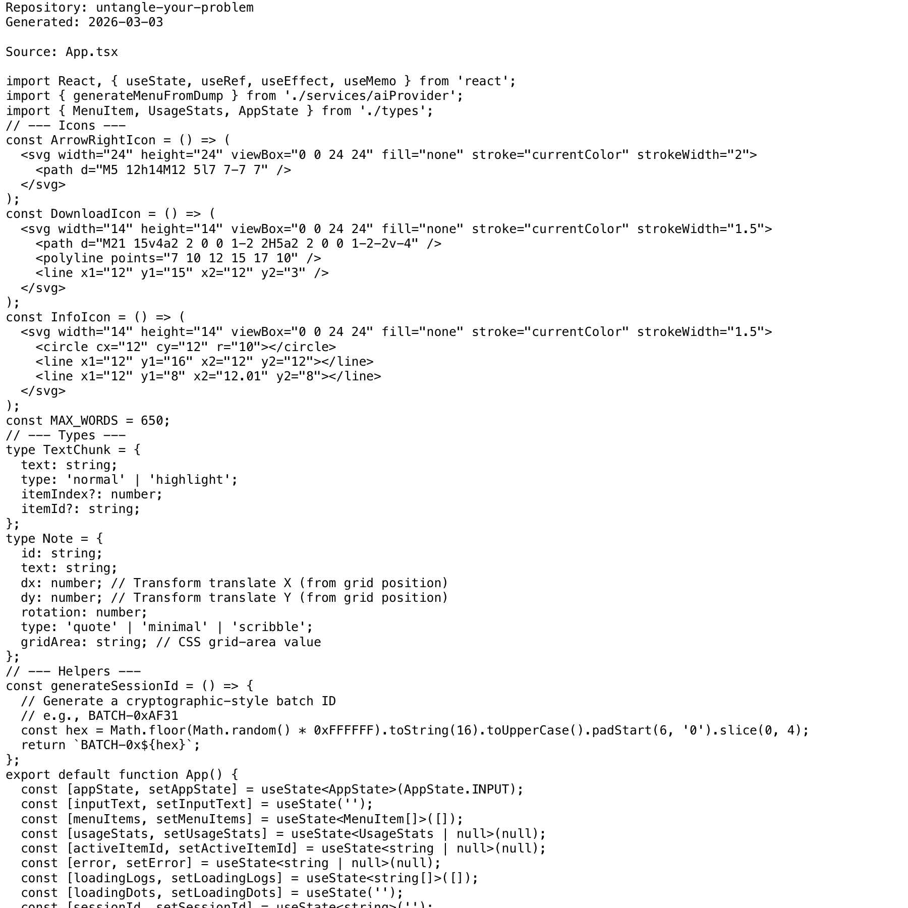

# Project Narrative & Proof

Generated: 2026-03-03

## User Journey
1. Discover the project value in the repository overview and launch instructions.
2. Run or open the build artifact for untangle-your-problem and interact with the primary experience.
3. Observe output/behavior through the documented flow and visual/code evidence below.
4. Reuse or extend the project by following the repository structure and stack notes.

## Design Methodology
- Iterative implementation with working increments preserved in Git history.
- Show-don't-tell documentation style: direct assets and source excerpts instead of abstract claims.
- Traceability from concept to implementation through concrete files and modules.

## Progress
- Latest commit: 6ad1130 (2026-03-03) - docs: add professional README with badges
- Total commits: 2
- Current status: repository has baseline narrative + proof documentation and CI doc validation.

## Tech Stack
- Detected stack: Node.js, TypeScript, GitHub Actions, JavaScript, HTML/CSS

## Main Key Concepts
- Key module area: `node_modules`
- Key module area: `services`

## What I'm Bringing to the Table
- End-to-end ownership: from concept framing to implementation and quality gates.
- Engineering rigor: repeatable workflows, versioned progress, and implementation-first evidence.
- Product clarity: user-centered framing with explicit journey and value articulation.

## Show Don't Tell: Screenshots


## Show Don't Tell: Code Excerpt
Source: `App.tsx`

```tsx
import React, { useState, useRef, useEffect, useMemo } from 'react';
import { generateMenuFromDump } from './services/aiProvider';
import { MenuItem, UsageStats, AppState } from './types';
// --- Icons ---
const ArrowRightIcon = () => (
  <svg width="24" height="24" viewBox="0 0 24 24" fill="none" stroke="currentColor" strokeWidth="2">
    <path d="M5 12h14M12 5l7 7-7 7" />
  </svg>
);
const DownloadIcon = () => (
  <svg width="14" height="14" viewBox="0 0 24 24" fill="none" stroke="currentColor" strokeWidth="1.5">
    <path d="M21 15v4a2 2 0 0 1-2 2H5a2 2 0 0 1-2-2v-4" />
    <polyline points="7 10 12 15 17 10" />
    <line x1="12" y1="15" x2="12" y2="3" />
  </svg>
);
const InfoIcon = () => (
  <svg width="14" height="14" viewBox="0 0 24 24" fill="none" stroke="currentColor" strokeWidth="1.5">
    <circle cx="12" cy="12" r="10"></circle>
    <line x1="12" y1="16" x2="12" y2="12"></line>
    <line x1="12" y1="8" x2="12.01" y2="8"></line>
  </svg>
);
const MAX_WORDS = 650;
// --- Types ---
type TextChunk = {
  text: string;
  type: 'normal' | 'highlight';
  itemIndex?: number;
  itemId?: string;
};
type Note = {
  id: string;
  text: string;
  dx: number; // Transform translate X (from grid position)
```
